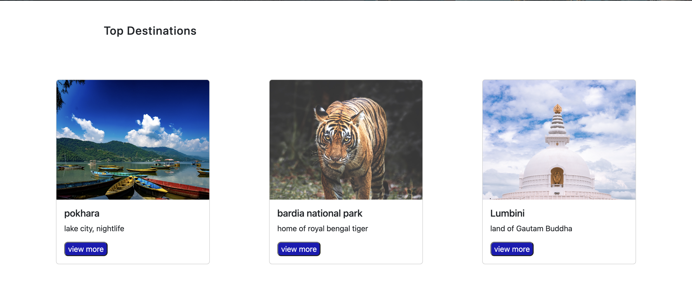
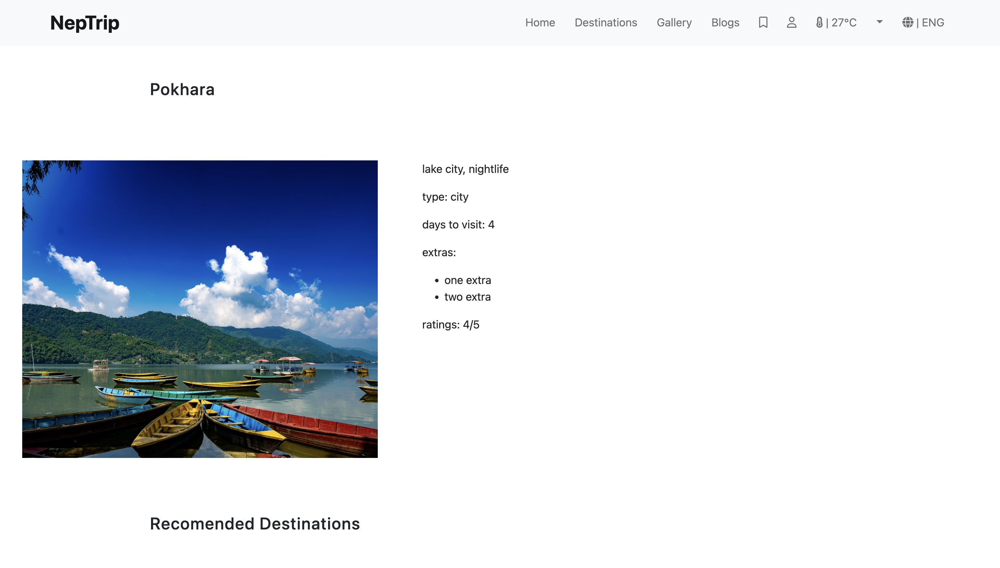

# NepTrip 
 UI for tourism based website.
 ## Feature:
 <ul>
  <li>Home page with images slider and top destinations </li>
  <li>Destination list page with filter function, filtering can be done using 3 parameters</li>
  <li>Destination Description page with destination recomendations </li>
  <li> Error page for error route </li>
</ul>

## Available Scripts

In the project directory, you can run:

### `npm start`

Runs the app in the development mode.\
Open [http://localhost:3000](http://localhost:3000) to view it in your browser.

The page will reload when you make changes.\
You may also see any lint errors in the console.

## Used:
<ul>
  <li>React Bootstrap for styling.</li>
  <li>react-router-dom for page navigation</li>
  <li>Context API for state management</li>
</ul>

# Home page
Home page with bootstrap navbar and slider.

# Top destinations 
Coponent for listing top 3 destinations.

# Destination List page with filter
Destenations are rendered according to filter

# Destination page with recomendations
Destination description page with recomendation.

